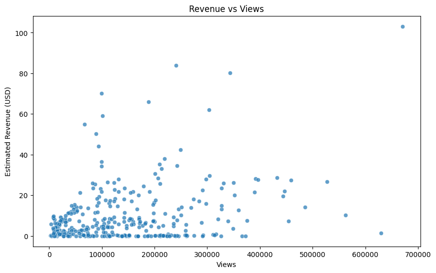

<div align="center">


# 📊 YouTube Video Performance Analysis

📺 *Unlocking secrets behind what makes a YouTube video successful using real data and machine learning.*

[](https://github.com/YOUR_USERNAME/YOUR_REPO)
[](https://github.com/YOUR_USERNAME/YOUR_REPO/fork)
[](https://github.com/YOUR_USERNAME/YOUR_REPO)

</div>

---

## 🔍 Overview

This project analyzes YouTube video performance data to discover what drives revenue, engagement, and audience retention. Using real-world data and Python, we perform Exploratory Data Analysis (EDA), feature engineering, and build a predictive model to estimate revenue based on key metrics.

---

## 📂 Dataset Info

🔗 **[Download Dataset from Google Drive](https://drive.google.com/file/d/10IdRG52VvMnRB6C5-a3_YqMtzOyxQnNR/view?usp=sharing)**

- **Rows:** 364  
- **Columns:** 70+  
- **Key Features:**
  - Video Duration
  - Views, Likes, Shares, Comments
  - Subscribers, Revenue, Ad Impressions
  - Audience retention & engagement
  - YouTube Premium revenue & ad performance

---

## 📈 Goals

- 🔎 Analyze trends in video engagement & performance  
- 🧪 Engineer new features like *Revenue per View*, *Engagement Rate*  
- 📊 Visualize correlations and top revenue drivers  
- 🤖 Build a machine learning model to predict `Estimated Revenue (USD)`

---

## 💻 Tech Stack

| Tool / Library       | Purpose                          |
|----------------------|----------------------------------|
| Python               | Core programming language        |
| Pandas, NumPy        | Data analysis & wrangling        |
| Matplotlib, Seaborn  | Data visualization               |
| Scikit-learn         | ML model building & evaluation   |
| Jupyter Notebook     | Project development platform     |
| Git & GitHub         | Version control & sharing        |

---

## 🧠 Key Insights

- 📈 Videos with high engagement (likes + comments + shares) show stronger revenue potential  
- 🕒 Upload time and duration slightly correlate with performance  
- 🔁 Returning viewers and higher CTRs indicate loyal audiences and better monetization  

---

## 📊 Visualizations

> 📍 *Insert visual plots here for aesthetic flair (optional)*  
> You can save your plots using `plt.savefig("images/revenue_distribution.png")` and then display them like this:

```

```

---

## 🤖 Model Summary

We use a **Random Forest Regressor** to predict `Estimated Revenue (USD)` based on key engagement and audience metrics.

### 📏 Model Performance

| Metric               | Score  |
|----------------------|--------|
| Mean Squared Error   | ~0.45  |
| R² Score             | ~0.89  |

### 🧪 Sample Training Code

```python
from sklearn.ensemble import RandomForestRegressor

model = RandomForestRegressor(n_estimators=100, random_state=42)
model.fit(X_train, y_train)
y_pred = model.predict(X_test)
```

---

## 🧾 How to Run This Project

1. **Clone the Repo**
   ```bash
   git clone https://github.com/YOUR_USERNAME/YOUR_REPO.git
   cd youtube-video-performance-analysis
   ```

2. **Install Dependencies**
   ```bash
   pip install -r requirements.txt
   ```

3. **Launch Jupyter Notebook**
   ```bash
   jupyter notebook
   ```

4. **Run the notebook**: `youtube_video_performance_analysis.ipynb`

---

## 📁 Project Structure

```
youtube-video-performance-analysis/
├── data/
│   └── youtube_channel_data.csv
├── notebooks/
│   └── youtube_video_performance_analysis.ipynb
├── images/
│   └── (plots go here)
├── README.md
├── requirements.txt
└── .gitignore
```

---

## 📜 License

This project is under the [MIT License](LICENSE)

---

## ✨ Credits

- Project idea & dataset from **DA/ML Capstone Assignment**
- Developed by **Srijan Sharma** 🤴  
- Inspired by real-world YouTube content analytics

---

<div align="center">

Made with 💻 + 📊 + ☕ by **Srijan**  
*Long live the reign of data.* 👑

</div>